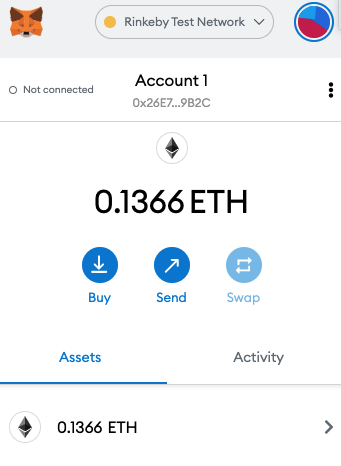
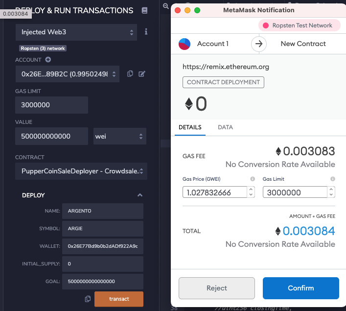
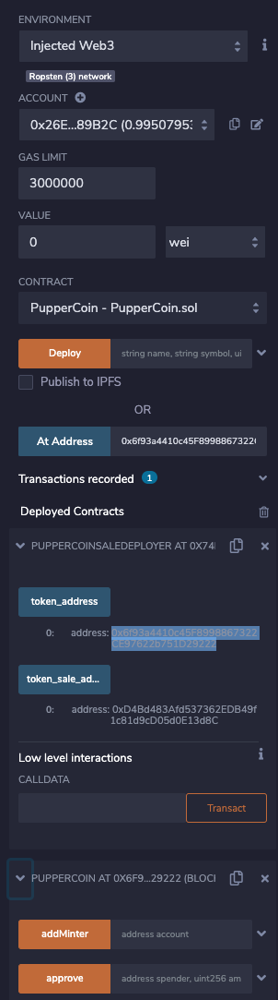
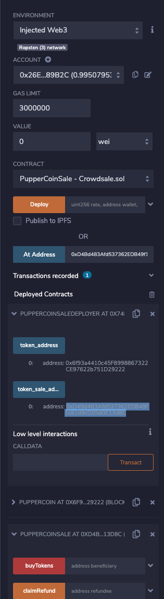
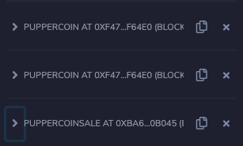
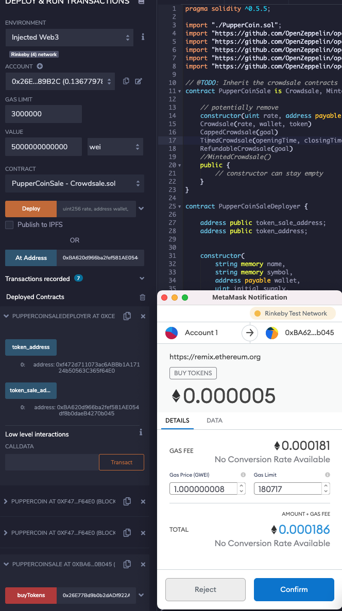
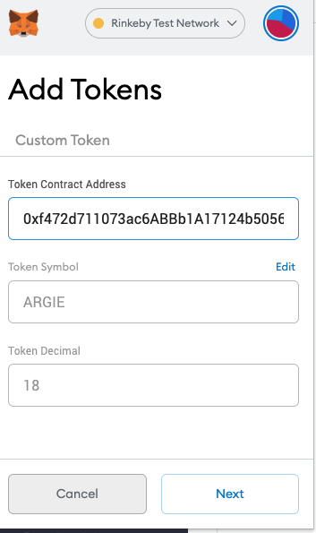
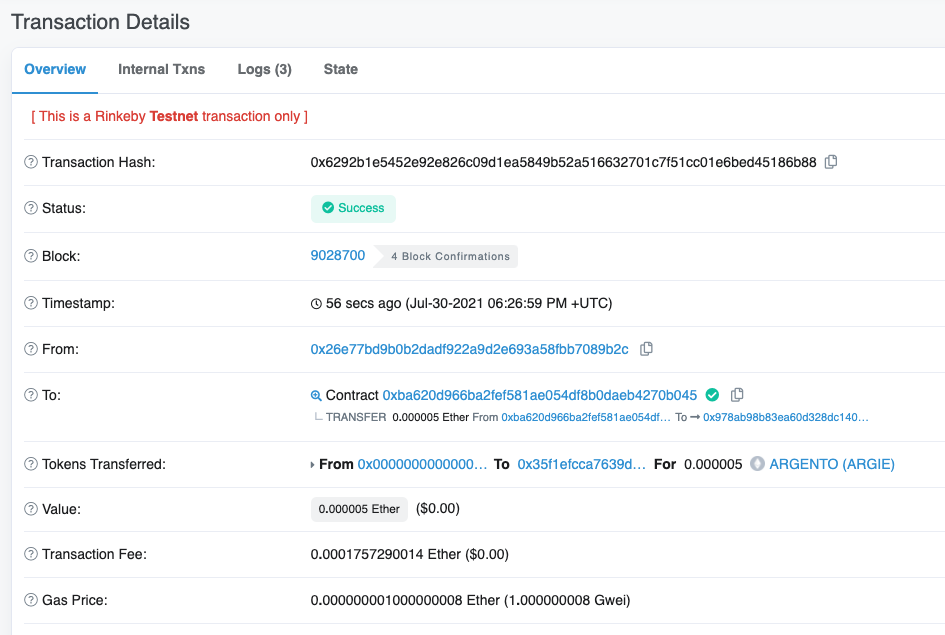
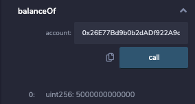

# Unit 21: You sure can attract a crowd!

## Background

Your company has decided to crowdsale their PupperCoin token in order to help fund the network development.
This network will be used to track the dog breeding activity across the globe in a decentralized way, and allow humans to track the genetic trail of their pets. You have already worked with the necessary legal bodies and have the green light on creating a crowdsale open to the public. However, you are required to enable refunds if the crowdsale is successful and the goal is met, and you are only allowed to raise a maximum of 300 Ether. The crowdsale will run for 24 weeks.

You will need to create an ERC20 token that will be minted through a `Crowdsale` contract that you can leverage from the OpenZeppelin Solidity library.

This crowdsale contract will manage the entire process, allowing users to send ETH and get back PUP (PupperCoin).
This contract will mint the tokens automatically and distribute them to buyers in one transaction.

It will need to inherit `Crowdsale`, `CappedCrowdsale`, `TimedCrowdsale`, `RefundableCrowdsale`, and `MintedCrowdsale`.

## Deploying the CrowdSale Contracts
1. Set the network as Rinkeby

2. Deploy CrowdSale Contract

    Deploy the Pupper Coin CrowdSale Deployer

    Then determine the name and symbol of the coin, the wallet behind it as well as the initial supply and the goal, which is set to be the same as the cap.

    Confirm in MetaMax, deployed the contract.

## Step 3 Deploy Pupper Coin Contract

    Use token address generate contract

   

# Step 4 Deploy Pupper Coin Sale Contract
    Use token sale address generate contract

    confirm that all the contracts have been deployed

## Buying Tracsaction

1.Buying the New Coin at the Crowd Sale We will buy from a different account to the account that created the coin, 0.05 ETH + 1 WEI to hit the goal and bet the ranch.

2. Add Token to the Wallet 

3.Transaction Success 

4.Check balanceOf

 

